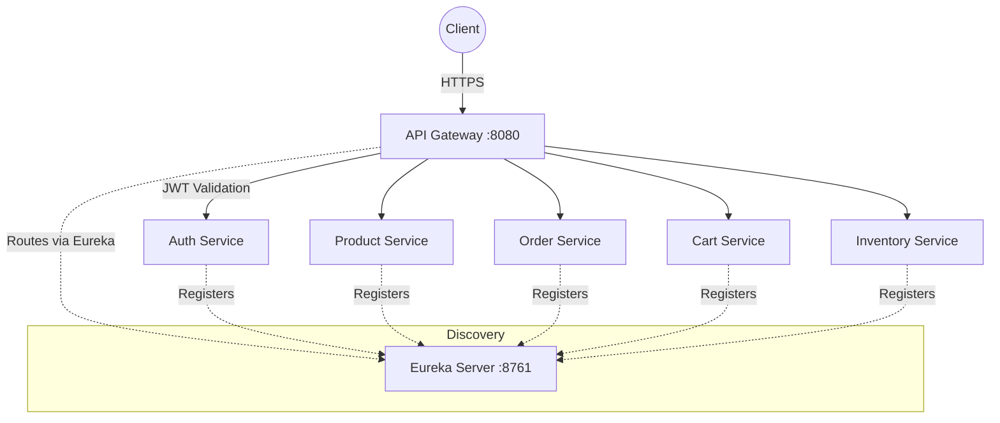
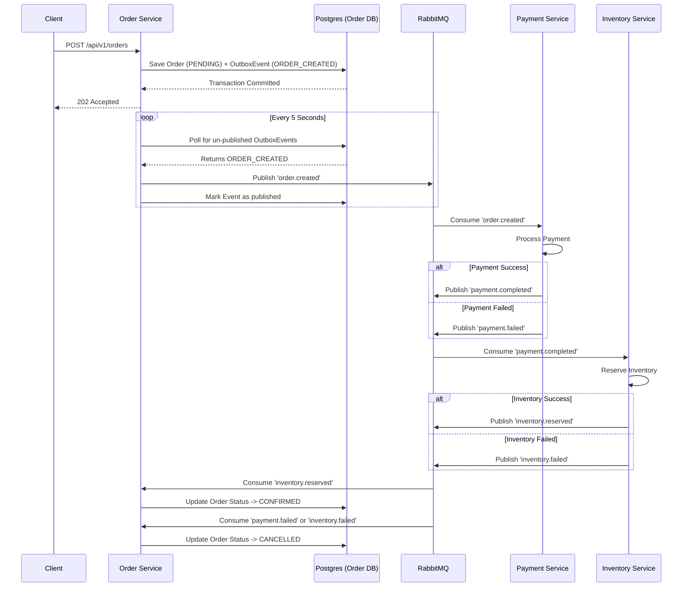

# System Architecture

This document describes the high-level architecture of the Microservices E-Commerce Platform.

## 1. Network Routing & Service Discovery
All incoming traffic is routed through the Spring Cloud Gateway (`api-gateway`). It acts as a reverse proxy, validates JWT tokens, and forwards the requests to the appropriate downstream microservice using Netflix Eureka (`discovery-server`).

## 2. Order Saga (Distributed Transactions)
Because databases are completely isolated per microservice, placing an order requires modifying data across `order-service`, `payment-service`, and `inventory-service`. To ensure atomicity and consistency, we use the **Transactional Outbox & Saga Pattern** orchestrated via RabbitMQ.

