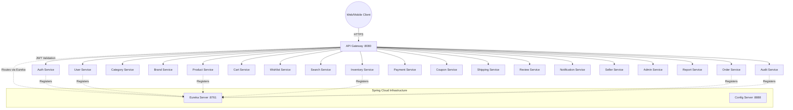
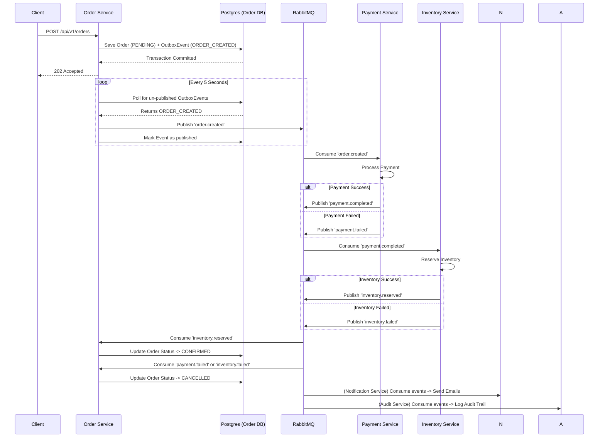

# System Architecture

This document describes the high-level architecture of the Microservices E-Commerce Platform. The platform runs on Spring Boot 3.2.4 and uses Netflix Eureka for service discovery, Spring Cloud Gateway for API routing, PostgreSQL for isolated per-service persistence, and RabbitMQ for asynchronous event-driven choreographies.

## 1. Network Routing & Service Discovery

All incoming external traffic routes through the Spring Cloud Gateway (`api-gateway`). The Gateway acts as a reverse proxy, validates JWT tokens, and dynamically forwards requests to the appropriate downstream microservice using the Netflix Eureka registry (`discovery-server`).

### The Complete Service Topology

## 2. Infrastructure Layer
- **Config Server (`config-server`)**: On boot, all services reach out to the Config Server via `spring.config.import`. The server loads `config-repo/*.yml` files directly, injecting database credentials and runtime properties.
- **Service Discovery (`discovery-server`)**: A centralized Netflix Eureka dashboard. Services send heartbeats every 30 seconds.
- **Docker Compose**: Uses a custom multi-stage Dockerfile to compile the parent POM, then `common-lib`, and finally the individual target service, resulting in a lightweight JRE Alpine container.
- **PostgreSQL**: Instead of deploying 16 separate database containers, a single Postgres container runs on port 5432 and uses a custom `init-multiple-databases.sh` script to auto-create `auth_db`, `order_db`, `product_db`, etc., upon initial volume creation.

## 3. Order Saga & Asynchronous Messaging

Because microservices do not share databases (Database-per-Service pattern), a distributed transaction like placing an order requires modifying data across `order-service`, `payment-service`, and `inventory-service` safely.

To ensure atomicity and consistency, we use the **Transactional Outbox & Saga Pattern** orchestrated via **RabbitMQ**.

### Outbox Pattern
When the `Order Service` receives a checkout request, it inserts the `Order` into the database and simultaneously inserts an `OutboxEvent` (e.g. `ORDER_CREATED`) in the exact same SQL transaction. A background poller then picks up this event and publishes it to RabbitMQ, ensuring that network failures do not result in lost messages.

### The Saga Flow

### Event Consumers
The platform relies heavily on pub/sub for side-effects:
- `notification-service`: Listens to `order.created`, `payment.completed`, `user.registered` to send mock emails/SMS.
- `audit-service`: Listens to various domain events to record user actions securely in an immutable log.
- `report-service`: Materializes views from events to optimize analytical queries without querying the live production transactional databases.
