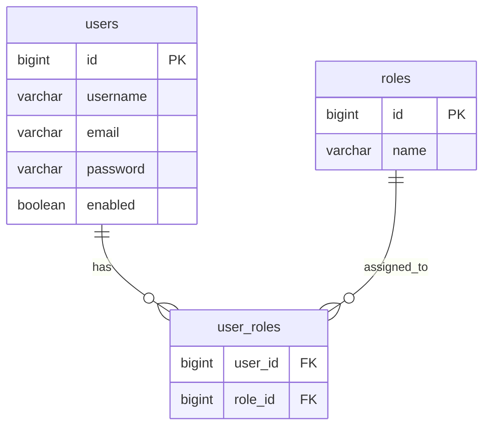
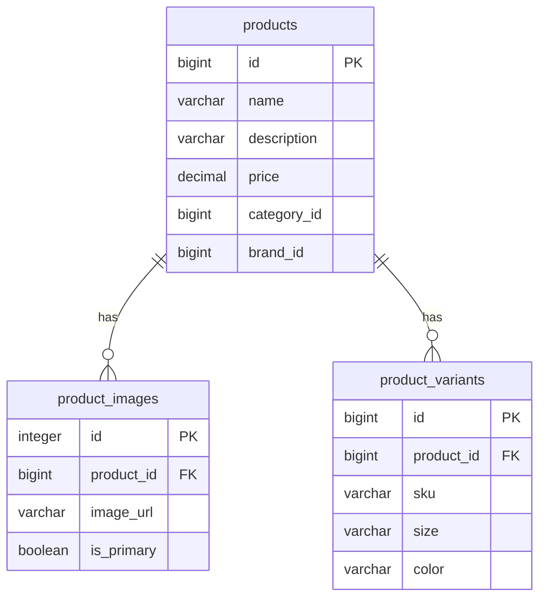
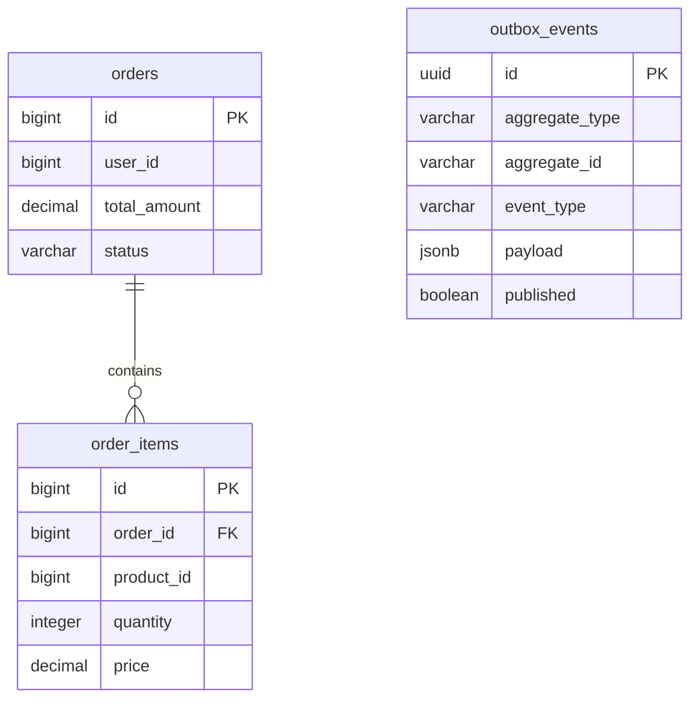
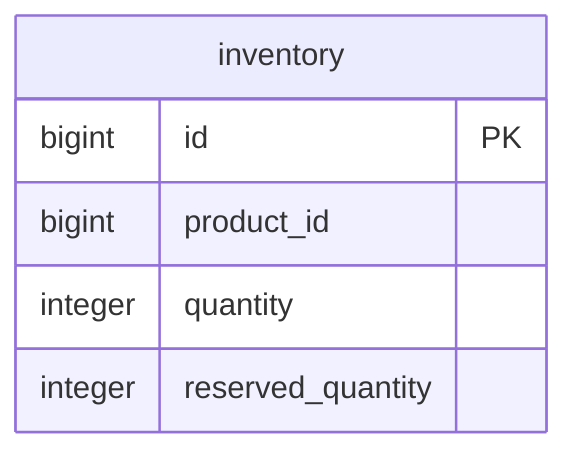
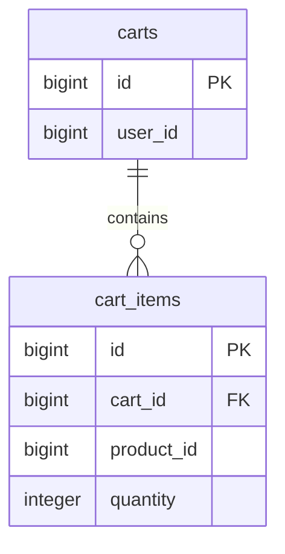

# Database Entity-Relationship Diagrams (ERD)

Because this is a microservices architecture, there are 20 **completely isolated** databases. Foreign keys *cannot* exist between services. We use logical IDs (like `user_id` or `product_id`) to loosely couple data.

## 1. Auth Service Database (`auth_db`)

## 2. Product Service Database (`product_db`)

## 3. Order Service Database (`order_db`)

## 4. Inventory Service Database (`inventory_db`)

## 5. Cart Service Database (`cart_db`)

