# Database ERD (Entity Relationship Diagram)

This document maps out the database schema for the Spring Boot E-Commerce Platform.

> [!NOTE]
> **Database per Service Architecture**
> Because this is a microservices platform, there are no foreign keys *between* the schemas below. For example, `orders` in the Order Database only stores the `user_id` as a reference; it does not have a hard relational tie to `users` in the Auth/User Database. Data integrity across services is maintained eventually via RabbitMQ Events.

```mermaid
erDiagram
    %% ==========================================
    %% Auth Service DB (auth_db)
    %% ==========================================
    users {
        BIGINT id PK
        VARCHAR username
        VARCHAR email
        VARCHAR password_hash
        VARCHAR role
        TIMESTAMP created_at
    }

    refresh_tokens {
        BIGINT id PK
        BIGINT user_id FK
        VARCHAR token
        TIMESTAMP expires_at
    }
    
    users ||--o{ refresh_tokens : "has"

    %% ==========================================
    %% User Service DB (user_db)
    %% ==========================================
    user_profiles {
        BIGINT id PK
        BIGINT user_id "Logical FK"
        VARCHAR first_name
        VARCHAR last_name
        VARCHAR phone
    }

    addresses {
        BIGINT id PK
        BIGINT user_id "Logical FK"
        VARCHAR street
        VARCHAR city
        VARCHAR zip
        VARCHAR country
        BOOLEAN is_default
    }
    
    user_profiles ||--o{ addresses : "manages"

    %% ==========================================
    %% Product Service DB (product_db)
    %% ==========================================
    products {
        BIGINT id PK
        VARCHAR name
        TEXT description
        DECIMAL price
        BIGINT category_id
        BIGINT brand_id
        VARCHAR sku
    }

    %% ==========================================
    %% Inventory Service DB (inventory_db)
    %% ==========================================
    inventory {
        BIGINT id PK
        BIGINT product_id "Logical FK"
        INT total_quantity
        INT reserved_quantity
        INT available_quantity
        TIMESTAMP updated_at
    }

    %% ==========================================
    %% Order Service DB (order_db)
    %% ==========================================
    orders {
        BIGINT id PK
        BIGINT user_id "Logical FK"
        VARCHAR status "PENDING/CONFIRMED/CANCELLED"
        DECIMAL total_amount
        TIMESTAMP created_at
    }

    order_items {
        BIGINT id PK
        BIGINT order_id FK
        BIGINT product_id "Logical FK"
        INT quantity
        DECIMAL unit_price
        DECIMAL total_price
    }
    
    orders ||--|{ order_items : "contains"

    outbox_events {
        BIGINT id PK
        VARCHAR aggregate_id
        VARCHAR event_type
        TEXT payload
        VARCHAR status "PENDING/PUBLISHED"
    }

    %% ==========================================
    %% Payment Service DB (payment_db)
    %% ==========================================
    payments {
        BIGINT id PK
        BIGINT order_id "Logical FK"
        DECIMAL amount
        VARCHAR method "CREDIT_CARD/UPI"
        VARCHAR status "PENDING/COMPLETED/FAILED"
        VARCHAR transaction_id
    }

    %% ==========================================
    %% Shipping Service DB (shipping_db)
    %% ==========================================
    shipments {
        BIGINT id PK
        BIGINT order_id "Logical FK"
        VARCHAR tracking_number
        VARCHAR status "PACKED/SHIPPED/DELIVERED"
        VARCHAR carrier
    }

    %% ==========================================
    %% Review Service DB (review_db)
    %% ==========================================
    reviews {
        BIGINT id PK
        BIGINT product_id "Logical FK"
        BIGINT user_id "Logical FK"
        INT rating "1-5"
        TEXT comment
    }

    %% ==========================================
    %% Audit Service DB (audit_db)
    %% ==========================================
    audit_logs {
        BIGINT id PK
        VARCHAR action
        VARCHAR entity_type
        VARCHAR entity_id
        VARCHAR performed_by
        TEXT old_values
        TEXT new_values
        TIMESTAMP timestamp
    }
    
    %% Other databases follow similarly...
```

## Flyway Migrations
Every database above is automatically generated on startup via the `docker/init-multiple-databases.sh` script (which runs when the PostgreSQL container boots for the very first time).

The actual schema execution is handled by **Flyway**. Each microservice contains a `src/main/resources/db/migration/V1__init_schema.sql` file. When a microservice boots up, Spring Boot auto-detects this file and executes it against the service's designated database.
